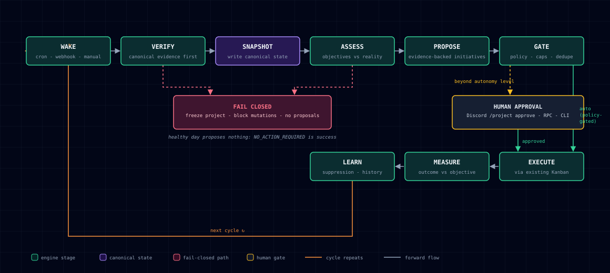
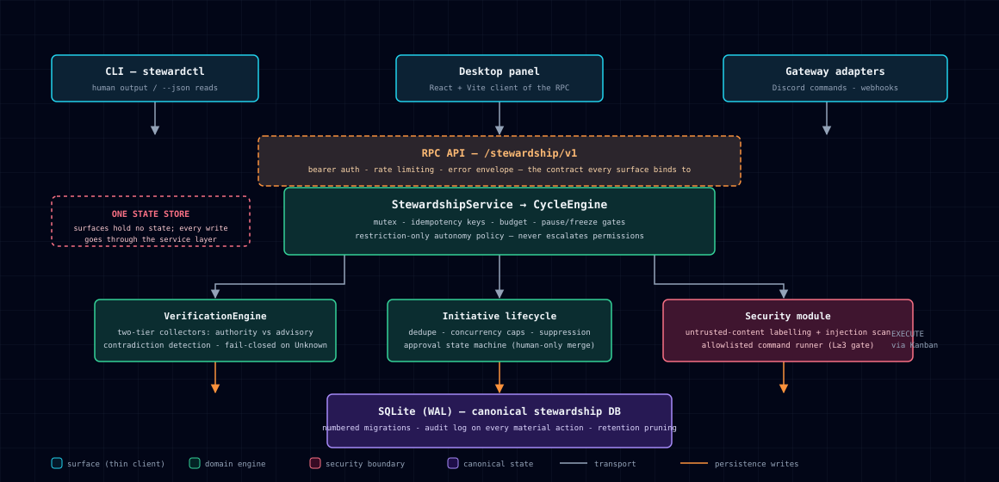

# Hermes Project Stewardship

Durable project **ownership** for Hermes agent fleets.

Hermes can complete tasks. Stewardship makes a team of Hermes profiles
**responsible for a project over time**: it verifies reality before acting,
turns gaps into evidence-backed initiatives, executes through existing Kanban,
enforces explicit autonomy policy, and measures whether the project actually
improved — from every surface (CLI, RPC API, Desktop panel, Discord/gateway).

> Status: **v0.2.0rc1 local release candidate.** Engineering and local quality
> gates are green. The candidate is not committed, tagged, published, installed
> or activated. Run `hermes verify --json` for current test and readiness evidence.

---

## The ownership loop

Every stewardship cycle walks the same ring:

```
WAKE → VERIFY → SNAPSHOT → ASSESS → PROPOSE → GATE → EXECUTE → MEASURE → LEARN ↺
```

- **Verify first.** A cycle may not claim project status or authorise mutating
  work without canonical evidence (git state, tests/CI, declared files).
  Memory and session history are supporting evidence only.
- **Fail closed.** Unknown or contradictory project state blocks mutations.
- **Autonomy is restriction-only.** Project policy may narrow what Hermes may
  do; it never escalates tool permissions or credentials.
- **No busywork.** `NO_ACTION_REQUIRED` is a first-class cycle outcome.

## System workflow

The full cycle as it runs in the engine — including where human approval and
the fail-closed freeze sit:



## Architecture

Canonical Hermes Projects/Kanban owns projects, tasks, epics, hierarchy,
dependencies and execution state. Dockyard owns stewardship policy, evidence,
rankings, views, workflows, approvals and audit metadata in its SQLite WAL
store. Production work writes cross the versioned host adapter; there is no
legacy task dual-write path.



### Surfaces

| Surface | Entry point | Notes |
|---|---|---|
| CLI | `stewardctl` | human output by default, `--json` on reads |
| RPC API | `/stewardship/v1` | FastAPI optional extra; bearer auth + rate limiting |
| Gateway commands | Discord et al. | permission binding + idempotent approvals |
| Desktop plugin | host React wrapper + vanilla TypeScript | thin client of the same RPC |

## Autonomy levels

| Level | Name | Allowed by default |
|---|---|---|
| 0 | Assistant | Inspect and answer only |
| 1 | Investigator | Observe, research, non-mutating diagnostics |
| 2 | Planner | + create initiatives/plans (no source changes) |
| 3 | Builder | + branches, code, tests, PRs (gated: see security model) |
| 4 | Maintainer | + low-risk merges when policy gates pass |
| 5 | Steward | Broad lifecycle within release/budget policy |

Level ≥ 3 additionally requires the runtime capability allowlist gate
(`docs/threat-model.md` §6). Levels 4–5 ship disabled pending the merge-gate
implementation (`docs/prd-v0.2.md` §Deferred).

## Install

Requires Python 3.10+. No third-party runtime dependencies for the core engine.

```bash
git clone https://github.com/Sahil-SS9/hermes-project-stewardship.git
cd hermes-project-stewardship
uv venv && uv pip install -e ".[dev]"
hermes verify --json         # bootstrap, full suite and readiness smoke
stewardctl --help           # CLI
uvicorn hermes_project_stewardship.api.server:app --port 9310   # RPC API
```

### Operational export and isolated restore

```bash
stewardctl --db ./stewardship.db export --output ./dockyard-export
stewardctl restore --archive ./dockyard-export --target ./restored.db
```

Exports use SQLite's online backup API and include a versioned manifest,
SHA-256 digest, byte size, schema version and integrity result. Restore refuses
existing targets, traversal, symlinks, checksum mismatches and invalid schemas.

## 60-second example

```python
from pathlib import Path
from hermes_project_stewardship.persistence.store import Store
from hermes_project_stewardship.cycles.engine import CycleEngine

store = Store(Path("./stewardship.db"))
svc = store.services()

svc.enable(project_id="my-repo", mission="Keep CI >99% and deps fresh",
           lead_profile="lead", member_profiles=["coder", "qa"])
svc.add_objective("my-repo", name="ci-health", evaluator_type="command",
                  target=">=0.99", command=["pytest", "-q"], severity="high")

engine = CycleEngine(svc)
result = engine.run_cycle("my-repo")
print(result["health"]["state"])          # e.g. "healthy"
print([i["title"] for i in result["initiatives"]])
```

Then:

```bash
stewardctl health my-repo
stewardctl initiative list my-repo
stewardctl initiative approve INIT-0001
```

See [examples/example-project](examples/example-project) for a full walkthrough,
and [demo/](demo/) for a scripted 5-act terminal demo plus an interactive HTML
dashboard of the same story.

## Documentation

- [PRD v0.2](docs/prd-v0.2.md) — product requirements this implementation satisfies
- [Architecture](docs/architecture.md)
- [Threat model](docs/threat-model.md)
- [Gateway command contract](docs/gateway-contract.md)
- [Roadmap to upstream Hermes core](docs/upstream-path.md)
- [API contract](docs/api.md)
- [Canonical roadmap](roadmap.md)
- [v0.2.0rc1 release packet](docs/release/0.2.0rc1-release-candidate.md)

## Security

Read [SECURITY.md](SECURITY.md) and [docs/threat-model.md](docs/threat-model.md)
before enabling autonomy above level 2 on any repository that accepts content
from untrusted people (issues, PRs, READMEs). Retrieved repository content is
untrusted input; it is never treated as authority over project policy.

## Licence

Apache-2.0. See [LICENSE](LICENSE).
